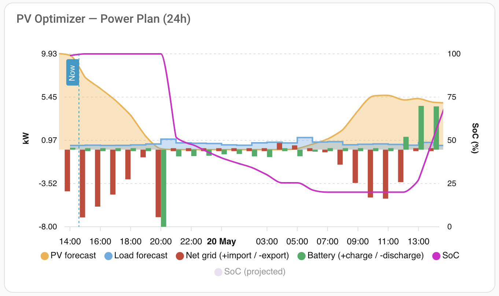
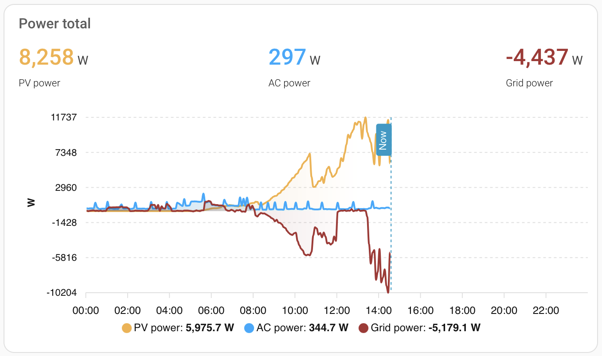
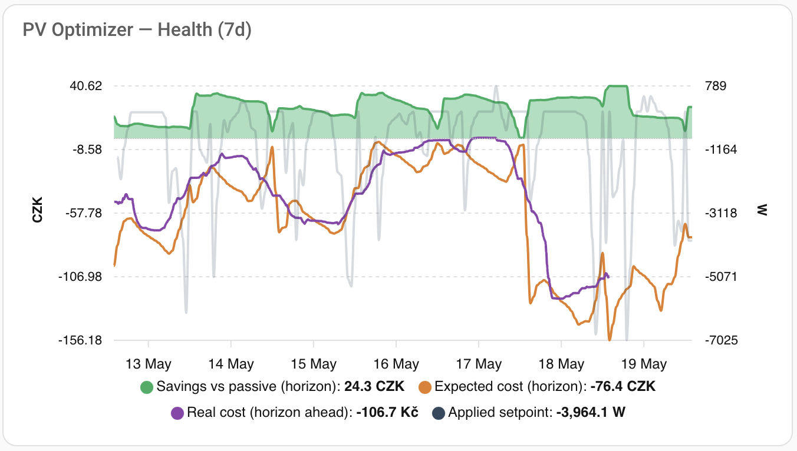
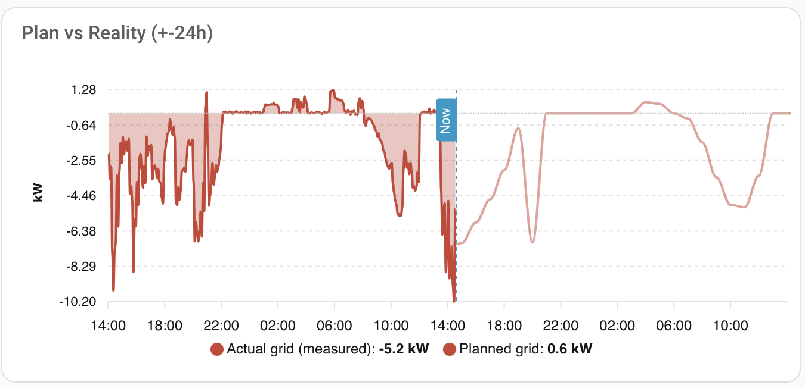
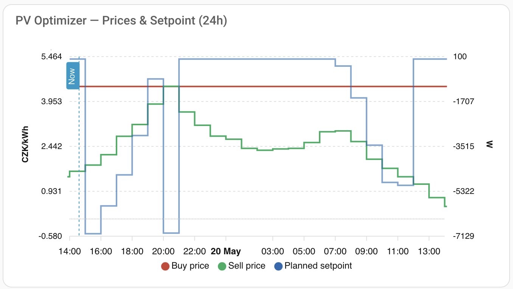

# Dashboard Cards

Home Assistant dashboard cards for monitoring the PV optimizer and household power.
All cards use [apexcharts-card](https://github.com/RomRider/apexcharts-card).

---

## PV Optimizer — Power Plan (24h)

Stacked bar chart of the next 24 hours produced by the LP solver. Bars show net
grid flow (import positive, export negative) and battery flow (charge positive,
discharge negative). Area overlays display the Solcast PV forecast and load
forecast. Lines track battery state-of-charge (SoC) on the right axis, with an
optional projected SoC series hidden by default.

📄 [pv_optimizer_plan.yaml](pv_optimizer_plan.yaml)

---

## Power Total

24-hour area chart showing real-time PV production, AC consumption, and grid
import/export, each aggregated to 5-minute means.

📄 [power_total.yaml](power_total.yaml)

---

## PV Optimizer — Health (7d)

Seven-day overview of optimizer performance. Dual Y-axis: left shows cost in
CZK (savings vs passive strategy, expected cost over the planning horizon, and
actual realised cost looked up at the matching future timestamp), right shows
the applied grid setpoint in watts.

📄 [pv_optimizer_health.yaml](pv_optimizer_health.yaml)

---

## Plan vs Reality (±24h)

48-hour comparison of planned vs measured grid power. The filled area is the
actual grid power (sensor, converted from W to kW), while the line is the
planned net grid flow from the optimizer. A "Now" marker separates past
measurements from future plan. Useful for validating how closely the optimizer's
plan matched real behaviour.

📄 [pv_optimizer_plan_vs_reality.yaml](pv_optimizer_plan_vs_reality.yaml)

---

## PV Optimizer — Prices & Setpoint (24h)

24-hour step-line chart showing electricity buy/sell prices (left axis,
CZK/kWh) alongside the planned grid setpoint (right axis, W). A zero-line
annotation highlights the break-even price. Helps visualise how the optimizer
adjusts the setpoint in response to price signals.

📄 [pv_optimizer_prices_setpoint.yaml](pv_optimizer_prices_setpoint.yaml)
